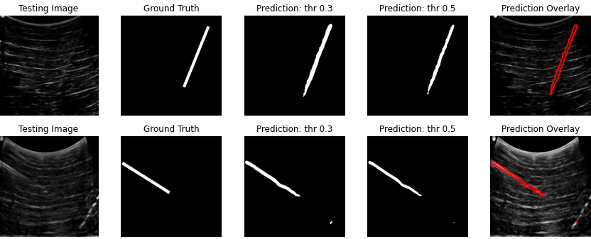

# Needle Segmentation For Real-time Guidance of Minimally Invasive Procedures Using Handheld 2D Ultrasound Systems 🩺💉

[](https://opensource.org/licenses/MIT)
[](https://www.python.org/downloads/)



A machine learning system for real-time guidance of minimally invasive procedures.

## 📖 Table of Contents
- [Installation](#-installation)
- [Usage](#-usage)
- [Project Structure](#-project-structure)
- [Data](#-data)
- [Notebooks](#-notebooks)
- [License](#-license)


## 💻 Installation

```bash
git clone https://github.com/PaulOkwija/needle_segmentation.git
cd needle_segmentation

# Create virtual environment
python -m venv nseg
sepsisenv\Scripts\activate  # Windows

# Install dependencies
pip install -r requirements.txt

# Obtain data and copy to folders
python src/obtain_image_data.py --data_path {path-to-imgs-and-csv-files}
```

## 🛠️ Usage

### Train Model
```bash
python src/train_pytorch.py --arch "UNet" -sd '/content/needle_segmentation/saved_models' --batch_size 8 --ep 5 -sz 256 --name 'UNet_orig'
```

<!-- ### Generate Predictions
```bash
python main.py predict \
    --input data/raw/testing_data \
    --output predictions/risk_scores.csv \
    --config config/paths.yaml
``` -->

## 📂 Project Structure
```
.
├── data/                       # Data storage
│   ├── raw/                    # Original CSVs and images
│   ├── processed/masks         # Processed data including generated masks
│   ├── interim/
│   └── external/          
│
├── results/                    # CSV Results (performances)
│   └── segmentation/           # Performance of segmentation models
│
├── notebooks/                  # Research notebooks
│   └── needle_segmentation.ipynb  # Final modular notebook analysis
│
├── src/                        # Core code
│   ├── models_definitions/     # Model architecture definitions
│   ├── detect.py               # Data ingestion
│   ├── general_utils.py        # Feature pipeline
│   ├── obtain_model.py         # Model classes
│   ├── train_pytorch.py        # Training script
│   ├── train_arch.py           # Testing model definitions
│   └── test_model.py           # Inference script
│
├── saved_models/               # Saved model/weights are saved here
├── requirements.txt            # Dependencies
└── README.md                   # This file

```
## 📊 Data
**Source:** Local and from Rutgers University  
**Format:** Images and csv files detailing needle delineation  

## 📓 Notebooks
The `notebooks/` directory contains the notebooks:

```bash
notebooks/
└── needle_segmentation.ipynb  # training and testing
```

## 📜 License
MIT License - See [LICENSE](LICENSE) for details

## ❤️ Acknowledgments
* Makerere Research and Innovations Fund for funding
* Rutgers University for data access


